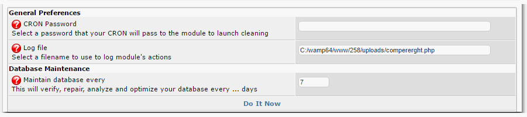
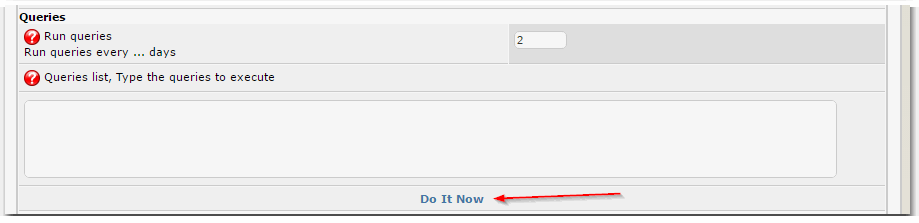
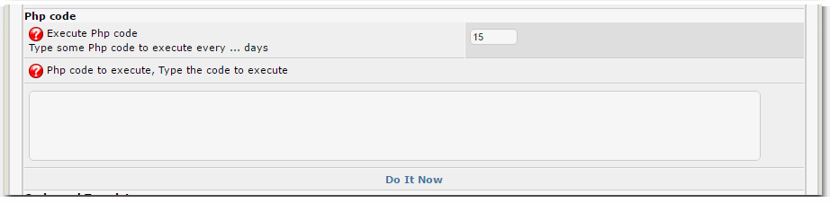
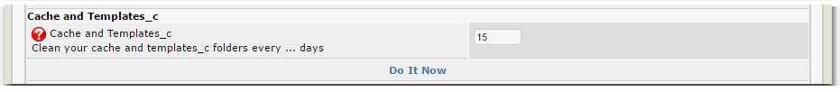
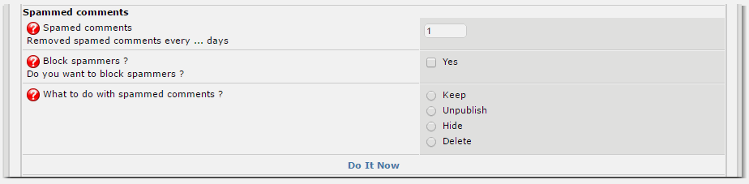
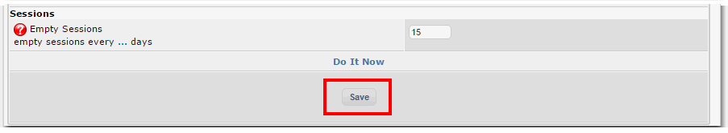
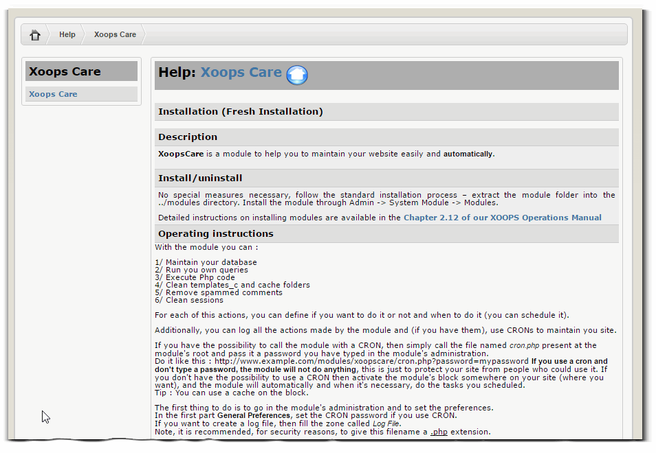

# Operating Instructions

 _Figure 3: General Preferences_

You can set here the main options for the module, especially for the Cron

 _Figure 4: Queries_

Sometimes you would like to run periodically some MySQL queries on your database - this is the place to entere them.

 _Figure 5: PHP Code_

If you have any specific PHP code that you would like to run every X days, this is the place to entere it.

 _Figure 6: Cache_

How often would you like to clear your cache? This might depend on the size of your storage. Some hosts limit the number of files you can have on your server, and this feature will help you to keep it low.

 _Figure 7: Spammed Comments_

Sometimes you're getting comments written by spammers, advertising their products and services. Here you can define what to do with them.

 _Figure 8: Sessions_

Define how often would you like to clear the Sessions table

If you need help, click on the Help tab, and there is some extra information:

